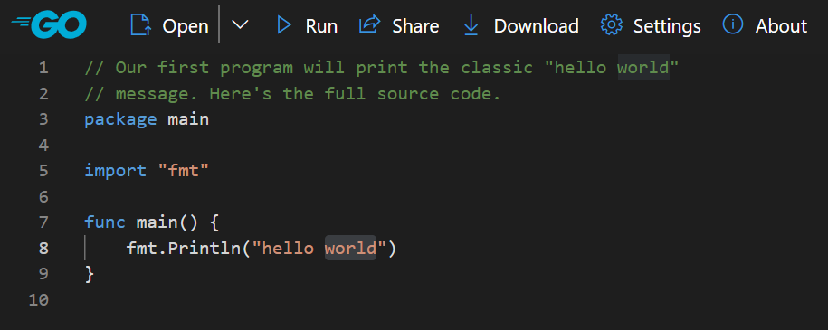
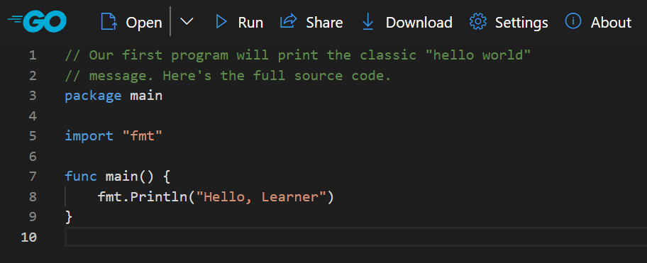
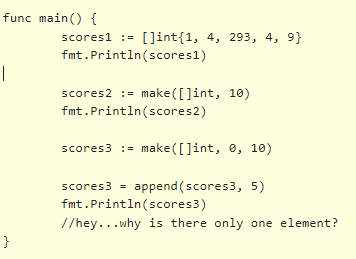

# Go!

<!-- TOC -->

- [Go!](#go)
    - [What is it?](#what-is-it)
    - [Whut?](#whut)
    - [Why use Go?](#why-use-go)
- [Part 1](#part-1)
    - [Go Fundamentals](#go-fundamentals)
    - [Hello Learner!](#hello-learner)
    - [Imports](#imports)
    - [Variables & Declarations](#variables--declarations)
        - [Variable Scope](#variable-scope)
            - [A Quick Note](#a-quick-note)
    - [For Loops](#for-loops)
    - [Flow Control](#flow-control)
    - [Arrays](#arrays)
    - [Slices](#slices)
    - [Reslice & Append](#reslice--append)
    - [Functions](#functions)
        - [Functions Can Return Multiple Values](#functions-can-return-multiple-values)
        - [I only care about one return type](#i-only-care-about-one-return-type)
- [Lab #1](#lab-1)
- [Part 2](#part-2)
    - [Structures, Methods & Pointers](#structures-methods--pointers)
        - [The Basics](#the-basics)
    - [Declarations](#declarations)
    - [Pointers](#pointers)
    - [Constructors](#constructors)
    - [Methods](#methods)
    - [Quick Lab](#quick-lab)
    - [STRUCTS & METHODS - Extended Lab](#structs--methods---extended-lab)
- [Part 3](#part-3)
    - [Maps, Ranges & Errors](#maps-ranges--errors)
    - [Maps](#maps)
    - [Range](#range)
    - [Errors](#errors)
    - [Custom Errors](#custom-errors)
- [Lab #2](#lab-2)
- [Part 4](#part-4)
    - [Installing Go](#installing-go)
    - [Install](#install)
    - [VS Code Extensions](#vs-code-extensions)
    - [Running and Building](#running-and-building)
    - [Formatting](#formatting)
- [Part 5](#part-5)
    - [Packages](#packages)
    - [How do we use our own packages?](#how-do-we-use-our-own-packages)
    - [Create a DB package](#create-a-db-package)
    - [Create a Shopping Package](#create-a-shopping-package)
    - [You still need a `main()`…](#you-still-need-a-main)
    - [Visibility – or public vs private](#visibility--or-public-vs-private)
    - [Package Management](#package-management)
    - [Go Mod Tidy](#go-mod-tidy)
- [Part 6](#part-6)
    - [Variadic, Anonymous Functions, Currying](#variadic-anonymous-functions-currying)
    - [Variadic Parameters](#variadic-parameters)
        - [Unfurling Slices](#unfurling-slices)
    - [Anonymous Functions](#anonymous-functions)
    - [Currying](#currying)
- [Part 7](#part-7)
    - [Interfaces](#interfaces)
        - [The Problem](#the-problem)
        - [What's an interface then?](#whats-an-interface-then)
    - [Implementing Interfaces In Go](#implementing-interfaces-in-go)
    - [Structural vs Nominative Polymorphism](#structural-vs-nominative-polymorphism)
    - [`interface{}` is a data type in Go](#interface-is-a-data-type-in-go)
    - [Lab - Academy Codility Test - in Go!](#lab---academy-codility-test---in-go)
- [Part 8](#part-8)
    - [Testing](#testing)
    - [Unit Testing](#unit-testing)
        - [Fallthrough](#fallthrough)
        - [t.Fail vs t.Error vs t.FailNow](#tfail-vs-terror-vs-tfailnow)
        - [Assertions](#assertions)
    - [Adding Tests In VS Code](#adding-tests-in-vs-code)
        - [Go doesn't ship your tests](#go-doesnt-ship-your-tests)
        - [Running Tests](#running-tests)
    - [Table Tests](#table-tests)
    - [Lab - Refactor](#lab---refactor)
- [Part 9 - ADVANCED](#part-9---advanced)
    - [Concurrency in Go](#concurrency-in-go)
    - [Goroutines](#goroutines)
        - [Goroutines Lab](#goroutines-lab)
    - [Channels](#channels)
        - [Channel Example](#channel-example)
- [Solutions](#solutions)

<!-- /TOC -->

## What is it?

Go is a statically typed, compiled programming language designed at Google by Robert Griesemer, Rob Pike, and Ken Thompson.

Go is syntactically similar to C, but with memory safety, garbage collection, structural typing, and CSP-style concurrency.

The language is often referred to as Golang because of its domain name, golang.org, but the proper name is Go.


## Whut?

It’s a programming language, designed by Google, primarily motivated by their dislike of C++ but keeping some characteristics they liked in other languages:

- static typing and run-time efficiency (like C),

- readability and usability (like Python or JavaScript),

- high-performance networking and multiprocessing.

---

Statically typed is a programming language characteristic in which variable types are explicitly declared and thus are determined at compile time. 

This lets the compiler decide whether a given variable can perform the actions requested from it or not. *Static typing associates types with variables, not with values*.

## Why use Go?

> “Golang is very useful for writing light-weight microservices. We currently use it for generating APIs that interact with our front-end applications. If you want to build a small functional microservice quickly, then Golang is a great tool to use.”

> “The advantages of using Go over other similar coding languages is that it’s an easy language for developers to learn quickly, and it has several built-in features to assist in asynchronous development.2

> “If you’re looking to build a back end service that isn’t data-science heavy, use Golang. Otherwise, use Python.”

> “The simplicity of the language makes for easier code review and debugging, while the philosophy of leanness in libraries also eases debugging. Meanwhile, the inclusion of all dependencies in the compiled binary makes for simple deployments.”

---

There are other areas where Go excels. For example, there are no dependencies when running a compiled Go program. You don't have to worry if your users have Ruby or the JVM installed, and if so, what version. 

For this reason, Go is becoming increasingly popular as a language for command-line interface programs and other types of utility programs you need to distribute (e.g., a log collector).

Put plainly, learning Go is an efficient use of your time. You won't have to spend long hours learning or even mastering Go, and you'll end up with something practical from your effort.


# Part 1

## Go Fundamentals

We're going to be learning the Go Fundamentals in the Go Playground, which means we don't have to install Go just yet.

NOTE: We used the old Go playground and are updating the pictures, but the contents will be the same.

https://goplay.tools/ 



---

## Hello Learner!

Change the string `hello world` to be `Hello, Learner`:



[Click here to see the code](https://goplay.tools/snippet/UTfp9e_aAbd)

Click the `Run` button to execute the code.

---

Hopefully, the code that we just executed is understandable. We've got a function named `main` and printed out a string with the `Println` function. 

The `Println` function is available from the `fmt` *package* that we import.

---

Saying that a language has a C-like syntax means that if you're used to any other C-like languages such as C, C++, Java, JavaScript and C#, then you're going to find Go familiar -- superficially, at least. For example, it means:
- `&&` is used as a boolean AND, 
- `==` is used to compare equality, 
- `{` and `}` start and end a scope, 
- and array indexes start at 0.

C-like syntax also tends to mean *semi-colon terminated* lines and parentheses around conditions. Go does away with both of these, though parentheses are still used to control precedence. 

In Go, the entry point to a program has to be a function called `main` within a `package main`.

We'll talk more about packages later. For now, while we focus on understanding the basics of Go, we'll always write our code within the `main` function.

## Imports


Go has a number of built-in functions, such as `Println`, which can be used without reference. We can't get very far though, without making use of Go's standard library and eventually using third-party libraries. In Go, the `import` keyword is used to declare the packages that are used by the code in the file.

```go
package main

import (
	"fmt"
	"os"
)

func main() {

	// `os.Args` provides access to raw command-line
	// arguments. Note that the first value in this slice
	// is the path to the program, and `os.Args[1:]`
	// holds the arguments to the program.
	argsWithProg := os.Args
	argsWithoutProg := os.Args[1:]

	// You can get individual args with normal indexing.
	//arg := os.Args[3]

	fmt.Println(argsWithProg)
	fmt.Println(argsWithoutProg)
	//fmt.Println(arg)
}
```

[Click here to see the code in the Go Playground](https://goplay.tools/snippet/fairSSz2PXW)


You've probably noticed we prefix the function name with the package, e.g., `fmt.Println`. 

This is different from many other languages. We'll learn more about packages in later chapters. For now, knowing how to import and use a package is a good start.

Go is strict about importing packages. It will **not** compile if you import a package but don't use it. 

Over time, you'll get used to it (it'll still be annoying though). Go is strict about this because unused imports can slow compilation; admittedly a problem most of us don't have to this degree.

Another thing to note is that Go's standard library is well documented. You can head over to https://golang.org/pkg/fmt/#Println to learn more about the `Println` function that we used. 

## Variables & Declarations

It'd be nice to begin and end our look at variables by saying you declare and assign to a variable by doing `x = 4`.

Unfortunately, things are more complicated in Go. We'll begin our conversation by looking at simple examples. Then, in the next section, we'll expand this when we look at creating and using structures. Still, it'll probably take some time before you truly feel comfortable with it.

You might be thinking *Woah! What can be so complicated about this?* 

Let's start looking at some examples:

```go
package main

import (
	"fmt"
)

func main() {
	var power int
	power = 9000
	fmt.Printf("It's over %d\n", power)
	
	//We can merge the first two lines:
	var short_power int = 9000
	
	//Go has a handy short variable declaration operator, :=, which can infer the type:
	shortest_power := 9000
	
	//You can also declare multiple variables at once
	var power1, power2 int = 1, 2
	
}
```
[Code here](https://goplay.tools/snippet/8oQwThFogpS)

The most explicit way to deal with variable declaration and assignment in Go is also the most verbose.

Go only has one keyword for declaring a variable - `var`. 

You'll notice that we can declare variables in multiple ways, and the first one infers the type from the assigned value, so 

`var a = "initial"`

Creates a variable named `a` infers the type as `string` from the value `"initial"`.

> NOTE : If you haven't worked with typed languages before, here's something you can do in Javascript:
>
> ```js
> let a = "initial"
> a = 1
> ```
>
> You CANNOT do this in Go. Once you have declared a variable as a type - even if the type has been inferred - you cannot give it another value that is of another type.

The last example is the one you will see most often used in Go, and is known as the *short assignment operator* `:=` :

```go
f := apple
```

You don't have to use the `var` keyword when using it.

### Variable Scope

It's important that you remember that `:=` is used to *declare* the variable as well as *assign* a value to it. Why? Because a variable can't be declared twice (not in the same scope anyway). If you try to run the following, you'll get an error.


```go
package main

import (
	"fmt"
)

func main() {
	power := 1000
	fmt.Printf("default power is %d\n", power)

	name, power := "Goku", 9000
	fmt.Printf("%s's power is over %d\n", name, power)
}
```
[Code here](https://goplay.tools/snippet/DxwHGSSZWpZ )

The compiler will complain with `no new variables on left side of :=`. This means that when we first declare a variable, we use `:=` but on subsequent assignment, we use the assignment operator `=`. This makes a lot of sense, but it can be tricky for your muscle memory to remember when to switch between the two.

If you read the error message closely, you'll notice that variables is plural. That's because Go lets you assign multiple variables (using either `=` or `:=`):

For now the last thing to know is that, like imports, Go **won't** let you have unused variables.

#### A Quick Note

The short assignment operator `:=` can only be used inside a function! To declare it at the package level, you must use `var`.

It’s semantically the same as

`var d int = 1`

Or

`var d = 1`

## For Loops

Go has only one looping construct, the `for` loop.
The basic `for` loop has three components separated by semicolons:
- **the init statement**: executed before the first iteration
- **the condition expression**: evaluated before every iteration
- **the post statement**: executed at the end of every iteration

```go
package main

import (
	"fmt"
)

func main() {

	//most baic type with a single condition
  i := 1
	for i <= 3 {
		fmt.Println(i)
		i = i + 1
	}

  //classic initial/condition/after loop
	for j := 7; j <= 9; j++ {
		fmt.Println(j)
	}

  //infinite loop!
	for {
		fmt.Println("loop")
		break
	}

  //continue to next iteration of the loop
	for n := 0; n <= 5; n++ {
		if n%2 == 0 {
			continue
		}
		fmt.Println(n)
	}
}

```
[Code here](https://goplay.tools/snippet/TeaO0Yxt95g )

The init statement will often be a short variable declaration, and the variables declared there are visible only in the scope of the `for` statement.

The loop will stop iterating once the boolean condition evaluates to false.

> Note: Unlike other languages like C, Java, or JavaScript there are no parentheses surrounding the three components of the for statement and the braces `{ }` are always required.

## Flow Control

Go's `if` statements are like its `for` loops; the expression need not be surrounded by parentheses `( )` but the braces `{ }` **are** required.

```go
func main() {

    //basic example
	if 7%2 == 0 {
		fmt.Println("7 is even")
	} else {
		fmt.Println("7 is odd")
	}

    //without else
	if 8%4 == 0 {
		fmt.Println("8 is divisible by 4")
	}

    //else if; any variables declared in this statement are available in all branches so be careful!
	if num := 9; num < 0 {
		fmt.Println(num, "is negative")
	} else if num < 10 {
		fmt.Println(num, "has 1 digit")
	} else {
		fmt.Println(num, "has multiple digits")
	}
}
```
[Code here](https://goplay.tools/snippet/UA6GTDP13YG )

## Arrays

If you come from Python, Ruby, Perl, JavaScript or PHP (and more), you're probably used to programming with dynamic arrays. These are arrays that resize themselves as data is added to them. 

In Go, like many other languages, arrays are *fixed*. Declaring an array requires that we specify the size, and once the size is specified, it cannot grow.


[Code here](https://goplay.tools/snippet/NIMcD_lX8q0 )

**Block 1** - Here we create an array a that will hold exactly 5 integers. The type of elements and length are both part of the array’s type. By default an array is zero-valued, which for integers means 0s.

**Block 2** - We can set a value at an index using the `array[index] = value` syntax, and get a value with `array[index]`.

**Block 3** - The builtin `len` returns the length of an array.

**Block 4** - Use this syntax to declare and initialize an array in one line:
> ```go
> b := [5]int{1,2,3,4,5}
>```

**Block 5** - We can use `len` to get the length of the array. `range` can be used to iterate over it. We'll discuss `range` later.

## Slices


In Go, you rarely, if ever, use arrays directly. Instead, you use *slices*. A slice is a lightweight structure that wraps and represents a portion of an array. There are a few ways to create a slice, and we'll go over when to use which later on. The first is a slight variation on how we created an array:

```go
  scores1 := []int{1, 4, 293, 4, 9}
```
 Unlike the array declaration, our slice isn't declared with a length within the square brackets.



[Code here](https://goplay.tools/snippet/xcMbUbQTx8B)

 To understand how arrays and slices are different, let's see another way to create a slice, using `make`. We use `make` instead of `new` because there's more to creating a slice than just allocating the memory (which is what `new` does). Specifically, we have to allocate the memory for the underlying array and also initialize the slice. 

 In this case, using make to create the slice creates and output for `scores2` of:

 `[0 0 0 0 0 0 0 0 0 0]`

 So we have a dynamic array with a capacity of 10, with ten integers already assigned as default values. This is known as the length of the slice (we initialize a slice with a length of 10 and a capacity of 10. The length is the size of the slice, the capacity is the size of the underlying array.). We can declare it to have zero length:

 ```go
 scores3 := make(([]int, 0, 10))
 ```

This creates a slice with a length of 0 but with a capacity of 10.

Appending to a slice of length 0 will set the first element, as the slice we mad had a length of zero (but can hold up to 10).

## Reslice & Append

How large can we resize a slice? Up to its capacity which, in this case, is 10. You might be thinking this doesn't actually solve the fixed-length issue of arrays. It turns out that `append` is pretty special. If the underlying array is full, it will create a new larger array and copy the values over (this is exactly how dynamic arrays work in PHP, Python, Ruby, JavaScript, ...). 


[Code here](https://goplay.tools/snippet/KANWcaYws90)

This is why, in the example above that used `append`, we had to re-assign the value returned by `append` to our scores variable: `append` might have created a new value if the original had no more space.

**What will block 2 do?**

Here, the output is going to be `[0, 0, 0, 0, 0, 9332]`. Maybe you thought it would be `[9332, 0, 0, 0, 0]`? To a human, that might seem logical. To a compiler, you're telling it to append a value to a slice that already holds 5 values.

### Stacks, Queues, Sorting & Filtering

Why do we need to reslice? Well, Go doesn't have built-in `pop` or `push` for stacks like other languages, so you have to use a slice.

If you want to know more, take a look at https://github.com/bjssacademy/go-stacks-queues-sort-filter

## Functions

Functions are very similar to other languages. There is a keyword `func`, the name of the function `plus`, and parameters `(a int, b int)` and the return type `int`:

```go
func plus(a int, b int) int {
  //..code here
}
```


[Code here](https://goplay.tools/snippet/lqPNF6DBVgX )

You call a function exactly like you'd expect with `functionName(arguments)`.

### Functions Can Return Multiple Values

This is a good time to point out that functions can return multiple values in Go:


When returning multiple values in Go, the return types must be enclosed in parenthesis `()`;


### I only care about one return type

Sometimes, you only care about one of the return values. In these cases, you assign the other values to. This is more than a convention. `_` the *blank identifier* is special in that the return value isn't actually assigned. This lets you use `_` over and over again regardless of the returned type.


[Code here](https://goplay.tools/snippet/MRJP8ntz47F)

---

# Lab #1

* Given an array of integers
  * Create a function that accepts the list
  * Returns the product (or the sum, I don’t care) of all the numbers

* Given a slice of strings like `[“1”, “3”, “77”, “hello”, “sunshine”]`
  * Create a function that accepts the slice
  * Returns the sum of all the EVEN integers  (`strconv.Atoi` may be needed here)
  * And returns the strings concatenated together

[Skeleton Code For Lab](https://goplay.tools/snippet/rTtHTqDSY3J)

[Go Cheatsheet](https://devhints.io/go)

---

# Part 2

## Structures, Methods & Pointers

### The Basics

Although Go doesn't do OO like you may be used to, you'll notice a lot of similarities between the definition of a *structure* and that of a *class*. A simple example is the following `Source` structure:


Go isn't an object-oriented (OO) language like C++, Java, Ruby and C#. It doesn't have objects nor inheritance and thus, doesn't have the many concepts associated with OO such as polymorphism and overloading.

What Go does have are structures, which can be associated with methods. Go also supports a simple but effective form of composition. Overall, it results in simpler code, but there'll be occasions where you'll miss some of what OO has to offer. (It's worth pointing out that composition over inheritance is an old battle cry and Go is the first language I've used that takes a firm stand on the issue.)

We'll soon see how to add a method to this structure, much like you'd have methods as part of a class. Before we do that, we have to dive back into declarations.

## Declarations
When we first looked at variables and declarations, we looked only at built-in types, like integers and strings. Now that we're talking about structures, we need to know how wer use them.

The simplest way to create a value of our structure is below.


[Code here](https://goplay.tools/snippet/xOQ8J-jzB9m)

Note: The trailing `,` in the above structure when we give it values on intialisation is required. Without it, the compiler will give an error. You'll appreciate the required consistency, especially if you've used a language or format that enforces the opposite.

We don't have to set all or even any of the fields. Both of these are valid:


[Code here](https://goplay.tools/snippet/R_DWHlrQCsd)

Just like unassigned variables have a zero value, so do fields.

Furthermore, you can skip the field name and rely on the order of the field declarations (though for the sake of clarity, you should only do this for structures with few fields).

## Pointers

What all of the above examples do is declare a variable `gas` and assign a value to it.

Many times though, we don't want a variable that is *directly* associated with our value but rather a variable that has a *pointer* to our value, that is, we don't want to have to return a value from our function, we want to be able to *alter* the original variable *without* having to return it in any way.

> If you have done C, then pointers in Go *are NOT exactly the same*.

Why do we want a pointer to the value, rather than the actual value? It comes down to the way Go passes arguments to a function: as *copies*. 

Here's a [fuller explanation about pointers in Go and examples](https://github.com/bjssacademy/go-pointers). Go ahead and read it, we'll wait here for you.

---

Knowing this about pointers work in Go, and the difference in by value and by reference, what does the following print:


The answer is 9000, not 19000. Why? Because Super made changes to a *copy* of our original source value and thus, changes made in Super weren't reflected in the caller. To make this work as you probably expect, we need to pass a pointer to our value.

### Using Pointers In Our Code


We made two changes. The first is the use of the `&` operator to get the address of our value (it's called the *address of* operator). Next, we changed the type of parameter `Super` expects. It used to expect a value of type `Source` but now expects an address of type `*Source`, where `*X` means pointer to value of type X. There's obviously some relation between the types `Source` and `*Source`, but they are two distinct types.

Note that we're still passing a copy of `gas`’s value to `Super` it just so happens that `gas`'s value has become an address. That copy is the same address as the original, which is what that indirection buys us. Think of it as copying the directions to a restaurant. What you have is a copy, but it still points to the same restaurant as the original.

### Pointers vs Values

As you write Go code, it's natural to ask yourself should this be a value, or a pointer to a value? 

1. **Use Pointers when you need to modify the original value**

If you want a function to be able to modify the original value of a variable, you should pass a pointer to that variable. This is because when you pass a value to a function in Go, a copy of the value is created, and modifications made to the copy do not affect the original.

```go
func modifyValue(v *int) {
    *v = *v * 2
}

func main() {
    x := 10
    modifyValue(&x)
    fmt.Println(x) // Output: 20
}

```

2. **Use Values for immutability and simplicity**

If your data is immutable or if you want to work with a copy of the data and NOT modify the original, then passing by value is appropriate.

```go
func calculateSquare(num int) int {
    return num * num
}

func main() {
    y := 5
    result := calculateSquare(y)
    fmt.Println(result) // Output: 25
    fmt.Println(y)      // Output: 5 (original value is unchanged)
}

```

Here is [an example](https://goplay.tools/snippet/wwt4TpEXYn1) of passing a value by Value and as a Pointer and how the value is or isn't updated.

## Constructors

Structures don't have constructors. Instead, you create a function that returns an instance of the desired type (like a factory):


Our factory doesn't have to return a pointer; this is absolutely valid:


## Methods

Go supports *methods* defined on struct types:


The area method has a *receiver type* of `*rect`:

```go
func (r *rect) area() int {
  return r.width * r.height
}
```

Keyword `func`, followed the the receiver type `(r *rect)` which indicates that it is a *method on the `rect` struct*, the name of the method `area()` and the return type `int`.

Methods can be defined for either pointer or value receiver types. The `perim` method is an example of Value type receiver.

Here we call the 2 methods defined for our struct.


Go automatically handles conversion between values and pointers for method calls. You may want to use a pointer receiver type to avoid copying on method calls or to allow the method to mutate the receiving struct.

[Code here](https://goplay.tools/snippet/Ep45Ns3yTlN)

## Quick Lab

Create a struct for a Circle that has diameter and radius as properties of type `int`

Implement methods to return the circumference and the area of the circle

## STRUCTS & METHODS - Extended Lab

Create a struct for a Circle that has diameter and radius as properties of type int​

Implement methods to return the circumference and the area of the circle​

Create a function that accepts a slice of  _ints_  that represent the radius of the Circle, and return a slice of Circle, ordered by the circumference of the Circle​

Example input might be: `[10, 5, 3,100,99, 12, 9, 1, 4, 35, 21]​`

[Skeleton code can be found here](https://goplay.tools/snippet/4e5CL43RNSY) 

---

# Part 3

## Maps, Ranges & Errors

## Maps

Maps in Go are what other languages call hashtables or dictionaries. They work as you expect: you define a key and value, and can get, set and delete values from it.

> If you are not sure what key-value pairs are, or want a more in-depth look at Mpas in Go, check out https://github.com/bjssacademy/go-maps

Maps, like slices, can be created with or without the `make` function. 


[Code here](https://goplay.tools/snippet/yRUAZAjpCr7)

To get the number of keys, we use len. To remove a value based on its key, we use delete

Maps grow dynamically. However, we can supply a second argument to make to set an initial size., `lookup := make(map[string]int, 100)`. If you have some idea of how many keys your map will have, defining an initial size can help with performance.

You can also declare maps *without* using `make`:

```go
lookup := map[string]int{}
```


## Range

We can iterate over a map using a for loop combined with the `range` keyword:


[Code here](https://goplay.tools/snippet/cvwftQosOvM)

So we have the `for` keyword, then the `key` (or index) and `value` variables that wil be assigned to on each iteration of the loop, the short assignment operator `:=`, and then the keyword `range` and our iterable (array, slice, map etc) variable `lookup`.

> NOTE! Iteration over maps isn't ordered. Each iteration will return the key value pair in a random order.

`range` iterates over elements in a variety of data structures. Let’s see how to use `range` with some of the data structures we’ve already learned:


> Here we use range to sum the numbers in a slice. Arrays work like this too.

`range` on arrays and slices provides both the `index` and `value` (the value returned being the `num` variable) for each entry. 

Above we didn’t need the `index`, so we ignored it with the blank identifier `_`. 

Sometimes we actually want the indexes though!

[More examples of range here](https://goplay.tools/snippet/CzyQe5jWaC-)

## Errors

In Go it’s idiomatic to communicate errors via an explicit, separate return value. This contrasts with the exceptions used in languages like Java and Ruby and the overloaded single result / error value sometimes used in C. Go’s approach makes it easy to see which functions return errors and to handle them using the same language constructs employed for any other, non-error tasks.


[Code here](https://goplay.tools/snippet/vcpKA8tPKFl)

https://pkg.go.dev/strconv

https://go.dev/blog/error-handling-and-go


## Custom Errors

We can create our own errors by importing the `errors` package and using it as a return type on a function:


[Code here](https://goplay.tools/snippet/2C2BmAlqt02)

---

# Lab #2

Create an in-memory key value store.

- For now assume keys and values will be strings

- HINT – you will need a `map`…

**Stretch goals**

1. Cater for arbitrary data types

2. Modify to return error values

> Skeleton code to be implemented - https://goplay.tools/snippet/QYVuuQYIceh

---

# Part 4

## Installing Go

## Install

* [https://go.dev/doc/install](https://go.dev/doc/install)
* Open the MSI file you downloaded and follow the prompts to install Go. By default, the installer will install Go to Program Files or Program Files (x86). You can change the location as needed. After installing, you will need to close and reopen any open command prompts so that changes to the environment made by the installer are reflected at the command prompt.
* Verify that you've installed Go.
  * In Windows, click the Start menu.
  * In the menu's search box, type cmd, then press the Enter key.
  * In the Command Prompt window that appears, type the following command: `go version`
  * Confirm that the command prints the installed version of Go.

## VS Code Extensions

Install the VS Code Go extension:

[https://code.visualstudio.com/docs/languages/go](https://code.visualstudio.com/docs/languages/go)

## Running and Building

Create `main.go`. For now, you can save it anywhere you want; we don't need to live inside Go's workspace for trivial examples.


> `println` is not `Println` and needs no import – that’s because println is part of the runtime of Go, and may be removed in future. 

Next, open a shell/command prompt and change the directory to where you saved the file.

`go run main.go`

`go build main.go`

## Formatting

Most programs written in Go follow the same formatting rules, namely a tab is used to indent and braces go on the same line as their statement.

When you're inside a project, you can apply the formatting rule to it and all sub-projects via:


Give it a try. It does more than indent your code; it also aligns field declarations and alphabetically orders imports.

---

# Part 5

## Packages

## How do we use our own packages?

1. Create a new folder (I’ve used `GoInADay` in my documents folder)

2. Open this folder up via VS Code

3. Open a new Terminal and run `go mod init store`


To keep more complicated libraries and systems organized, we need to learn about packages. 

A note on go mod and its history – sometimes you’ll look up things about Go and it’ll tell you all about GOPATH or GOROOT. This applies to older versions of Go. For our purposes we’ve ignored it and are only using modules.

When you do this, you will have a `go.mod` file in your root which is like `package.json` in node – it’s really a list of all your packages and where you get them. Maven, Nuget – all similar things.

In the store directory, open the `go.mod` file using nano, or your favorite text editor:

The first line, the module directive, tells Go the name of your module so that when it’s looking at import paths in a package, it knows not to look elsewhere for store. The store value comes from the parameter you passed to go mod init.

This will become very important shortly about how Go finds its packages

## Create a DB package

Create a new folder under your base folder  (for me _GoInADay_ referenced as the module  _store_  in `go.mod`) called `shopping` and a subfolder within it called `db`:


Inside of shopping/db, create a file called db.go and add the following code:


In Go, package names follow the directory structure of your Go workspace. If we were building a shopping system, we'd probably start with a package name "shopping" and put our source files in `/shopping/`.

We don't want to put everything inside this folder though. For example, maybe we want to isolate some database logic inside its own folder. To achieve this, we create a subfolder at `/shopping/db`. The package name of the files within this subfolder is simply `db`, but to access it from another package, including the shopping package, we need to `import shopping/db`.

In other words, when you name a package, via the package keyword, you provide a single value, not a complete hierarchy (e.g., "shopping" or "db"). When you import a package, you specify the complete path.

Notice that the name of the package is the same as the name of the folder. Also, obviously, we aren't actually accessing the database. We're just using this as an example to show how to organize code.


## Create a Shopping Package

Now, create a file called `pricecheck.go` inside of the main shopping folder.


You’ll see here that we need to refer to the fully-qualified path from the module root (GoInADay folder) up to the `db` package. This is what you have to remember about modules!

It's tempting to think that importing `shopping/db` is somehow special because we're inside the shopping package/folder already. In reality, you're importing `store/shopping/db`, which means you could just as easily import test/db so long as you had a package named db inside of your workspace’s modulename/test folder.

## You still need a `main()`…


If you're building a package, you don't need anything more than what we've seen. To build an executable, you still need a main. I added mine to the root, but other prefer to create a folder – for instance named shopping – and put it in there.

You can now run your code by going into your shopping project and typing:

`go run main/main.go`

## Visibility – or public vs private

Go uses a simple rule to define what types and functions are visible outside of a package. If the name of the type or function starts with an uppercase letter, it's visible. If it starts with a lowercase letter, it isn’t.

This also applies to structure fields. If a structure field name starts with a lowercase letter, only code within the same package will be able to access them.

For example, if our `db.go` file had a function that looked like:


it could be called via `db.NewItem()`. But if the function was named `newItem`, we wouldn't be able to access it from a different package.

Go ahead and change the name of the various functions, types and fields from the shopping code. For example, if you rename the Item's `Price` field `to price`, you should get an error.

## Package Management

* The go command we've been using to run and build has a get subcommand which is used to fetch third-party libraries. `go get` supports various protocols but for this example, we'll be getting a library from Github.

* From a shell/command prompt, enter:
  * `go get github.com/mattn/go-sqlite3`
  * `go get` fetches the remote files and stores them in your workspace. Go ahead and check your $module/src. In addition to the shopping project that we created, you'll now see a `github.com` folder. Within, you'll see a `mattn` folder which contains a `go-sqlite3` folder.

We just talked about how to import packages that live in our workspace. To use our newly gotten go-sqlite3 package, we'd import it like so:


I know this looks like a URL but in reality, it'll simply import the go-sqlite3 package which it expects to find in `$module/github.com/mattn/go-sqlite3`.

## Go Mod Tidy


This command will basically match the `go.mod` file with the dependencies required in the source files. You can think of it like `npm install` or `pip install`.

  * Download all the dependencies that are required in your source files and update `go.mod` file with that dependency.
  * Remove all dependencies from the `go.mod` file which are not required in the source files.

---

# Part 6

## Variadic, Anonymous Functions, Currying

## Variadic Parameters

Rather than accepting a slice – in this case of int - we might want to accept any amount of ints directly:


[Code here](https://goplay.tools/snippet/07zjjtCigQX)

> NOTE: Your variadic parameter must be last in the argument list. 
>
> Cannot have variadic first, must be last and there can be only one!

### Unfurling Slices

If you’ve done some JS, you will have seen this!


[Code here](https://goplay.tools/snippet/PTfVUcbJC5R)

## Anonymous Functions

Anonymous functions can be declared inside other functions:


[Code here](https://goplay.tools/snippet/g69eS4XV4fd)

Note in the first one we do not have to provide a param to it.

In the second, we do.

## Currying

Function named wtf which has no parameters, returns an anonymous function which has no parameters that returns a string.


[Code here](https://goplay.tools/snippet/91Zq90R1FdP)

The important thing about currying is the function returns a function *and* a return type!

---

# Part 7
## Interfaces

> If you have used interfaces before and understand them, feel free to skip to [Implementing Interfaces](#implementing-interfaces-in-go).

Okay, so this is going to be a bit of a leap now. We're going to look at some of the advantages of Object Oriented Programming (OOP) in particular the use of interfaces.

Trying to describe interfaces generally ends up being a talk about abstraction, polymorphism, or decoupling.

We shall now attempt the impossible and try to give examples without using any of those words.

In the pseudocode we are going to use, a `class` is similar to a `struct`.

### The Problem

Let's imagine we have a different types of media - CD, MP3, and Record. They all need different devices to play them.

When we represent this in pseudocode, we can create three separate *classes*:

```
class CDMedia:
    method Play():
        Print "CDPlayer playing..."

class MP3Media:
    method Play():
        Print "MP3Player playing..."

class RecordMedia:
    method Play():
        Print "RecordPlayer playing..."

```

Now, imagine we are a mythical radio station - Academy FM - that plays new music sent to us in one of these media formats.

When we receive the media, we have to choose what player we need, and press play.

In pseudocode, that might look something like this:

```
if mediaType == "CD":
    player = new CDMedia()
    player.Play()

if mediaType == "MP3":
    player = new MP3Media()
    player.Play()

if mediaType == "Record":
    player = new RecordMedia()
    player.Play()
```

And this is fine. It works, and the code's pretty clean and understandable.

Now we want to have a scheduler of when to play these songs overnight when we are in bed, so our nighttime listeners can have some company.

So we want to create a list, or collection of all the songs we want to play, which are all on different media, and then set it off before we leave for the night. Sounds easy right? We just create a list of all the media we want to play and loop round it pressing Play() each time, surely?

Wait - how do we have mixed data types in a list? We've got MP3s, Records and CDs. They all have the same Play() method, but how do we access it?

So we might have a list of songs on media like this:

- Your Song (Record)
- Bad Habits (MP3)
- Running Up That Hill (CD)
- Peggy Sue (Record)

...and many more. But they are all different data types, even though they have the same named methods. We can't, for instance, do this in code:

```
List<Record> toBePlayed = new List<>(); //create a List of type Record

toBePlayed.Add(new RecordMedia()); //ok, add a record to the List

toBePlayed.Add(new MP3Media()); //won't work - MP3Media is not the same type as needed by the list!

```

> You cannot mix data types in a list like this.

But we have the same method we want in all of them. It shouldn't be this hard? Maybe I can pass three lists in each of the right type and do some randomization of the playlist? Maybe I could provide the list as a list of strings, and do some looping around?

Well, I guess you could, but there is a far easier way: using an interface.

### What's an interface then?

An interface is a contract. It states that all things that use (*implement*) that interface are **guaranteed** to have exactly the methods and properties defined in the interface. <ins>But the interface itself contains no executable code.</ins>

> A good example of how this contract works would be to look at how a franchised business works. Many people patronize specific companies due to “brand recognition”. Think of a large, chain, business near you. Let’s use Starbucks, for example. 
>
>Starbucks is well known and has established itself as a trustworthy coffee shop where you are guaranteed to receive a certain level of service and product. Now, if you wanted to open a coffee shop as a small business, would you choose to open an independent coffee shop or would you pay a franchising fee to Starbucks to use their logo and marketing, as well as having to follow their corporate rules and regulations? Well, while an indie coffee shop provides more flexibility, customers may be less willing to patronize your indie shop since the service and product you provide is of an unknown quality and is also subject to change at any time without warning. 
>
>A franchised Starbucks location on the other hand, is a known quantity due to your “contract” with the Starbucks corporation. Everyone knows what they’re getting, there are clearly laid out policies for everything including returns, refunds, and other customer satisfaction issues. Starbucks did a lot of the early, difficult, work of creating a brand that customers recognize and trust, you just must follow their corporate rules in order to benefit from that hard work.
>
>In our case, the small business owner would be comparable to the class and the Starbucks corporation would be the Interface. The “contract” is the contract that you, as a business owner, sign with the corporation (Starbucks/the Interface) in order to benefit from using their work. Our Interfaces have a set of rules that we must follow, and this, in both business and software development, keeps things nice, tidy, organized, and predictable.

That means that if we have an interface that says *"everything that uses (implements) me MUST have the method Play() available"* then that is a contract or guarantee that the Play() method WILL be available.

When a class uses an interface, we say it *implements* that interface. Any class that *implements* an interface, must, by definition, also implement all the methods and properties defined in the interface.

Enough talk, let's see what an interface might look like:

```
interface IMedia
{
    method Play()
    method Pause()
    method Stop()
}

```

Okay, so to define an interface we use the keyword interface, then the name we want it to have (by convention in many languages, interface names are preceded with a capital I).

Then we have our methods that every implementing class MUST have in order to correctly adhere to the contract.

And to implement an interface in a class:

```
class MP3Media implements IMedia
{
    method Play():
        Print "MP3Player is playing."

    method Pause():
        Print "MP3Player is paused."

    method Stop():
        Print "MP3Player is stopped."
}

```
Let's now assume all our classes implement this interface. We can now do something very magical. We can create a List that accepts all the classes that implement that interface:

```
    List<IMedia> toBePlayed = new List<IMedia>()
    toBePlayed.Add(new MP3Media())
    toBePlayed.Add(new CDMedia())
    toBePlayed.Add(new RecordMedia())

```

And because we know each of those concrete instances MUST implement all of the methods in the interface, we can iterate over that list and for each item access its Play() method, even though each method outputs different results and we don't know exactly what type of media we are playing:

```
foreach media in toBePlayed:
  media.Play()

```

Which would output:

```
MP3Player is playing.
CDPlayer is playing.
RecordPlayer is playing.
```
---
## Implementing Interfaces In Go

```go
type Employee interface {
	CalculateSalary() int
}

type Permanent struct {
	empid         int
	basicpay      int
	additionalpay int
}

type Contract struct {
	empid    int
	basicpay int
}
```

Okay, first thing you’ll notice is again….this isn’t Java or C# type interfaces you may be used to.

Implementing interfaces is not done the same way – there appears to be no relation between our structs and our interface…

```go
func (p Permanent) CalculateSalary() int {
	return p.basicpay + p.additionalpay
}

func (c Contract) CalculateSalary() int {
	return c.basicpay
}
```

We have to create a function with a *receiver of the type of struct* for each with the **EXACT** name and return type declared in our interface, much like we did when creating methods for structs.

By doing this, both the `Permanent` and `Contract` structs are said to *conform* to the interface, and can therefore be treated as a type of `Employee`.

Go doesn’t care, this is just how it is…

We create a list of Employees in main, let’s follow along as to what happens….

```go
func TotalMonthlyCost(e []Employee) {
	total := 0
	for _, v := range e {
		total = total + v.CalculateSalary()
	}
	fmt.Printf("Total Monthly Cost: £%d", total)
}

func main() {
	perm1 := Permanent{1, 5000, 20}
	perm2 := Permanent{2, 5000, 50}
	cont1 := Contract{3, 3000}

	employees := []Employee{perm1, perm2, cont1}

	TotalMonthlyCost(employees)
}
```

[Code here](https://goplay.tools/snippet/gr79VBrJW7W)

We create 2 `Permanent` and one `Contract`:

```go
perm1 := Permanent{1, 5000, 20}
perm2 := Permanent{2, 5000, 50}
cont1 := Contract{3, 3000}
```

So far, everything normal. Then we create a *slice* of type `Employee` - we can add both of these different data types to it because they both conform to all the interface definitions:
```go
employees := []Employee{perm1, perm2, cont1}
```

Now we can call the method defined on both structs (`CalculateSalary`) without having to know the concrete implementation.

## Structural vs Nominative Polymorphism

For the nerdy amongst you, Go uses *structural polymorphism* which is also known as compile-time polymorphism, and refers to the ability of different types to exhibit certain structural similarities.

*Nominative polymorphism* involves the use of inheritance and subtype relationships to achieve polymorphic behavior. Objects of different types can be treated uniformly through a common supertype or interface. 


## `interface{}` is a data type in Go

Okay, you may remember we said you can't have lists of different/mixed data types, and this is why you implement an interface, so you can have a list that is the underlying type.

Well in Go, you can use interface as a direct type:

```go
  var a interface{}

	a = 10

	fmt.Println(a)

	a = "hello"

	fmt.Println(a)
```

This is roughly equivalent to `any` in Typescript. I would highly caution you against using it like this though...

You can also use it for slices containing mixed data types too:


```go
  a := []interface{}{
		10,
		"something",
		19.7,
	}

	fmt.Println(a)
```

## Lab - Academy Codility Test - in Go!

A hospital has five departments: Cardiology, Neurology, Orthopaedics, Gynaecology and Oncology. There are N patients, numbered from 0 to N-1, and the K-th of them is in department represented by a string A[K].

Write a function that, given an array A consisting of N strings, returns the maximum number of patients in one department.

Examples:

1. Given A = ["Cardiology", "Orthopaedics", "Neurology", "Cardiology", "Orthopaedics", "Cardiology"], the function should return 3. The department of Cardiology is occupied by three patients.

2. Given A = ["Oncology", "Gynaecology", "Orthopaedics", "Oncology", "Gynaecology", "Orthopaedics"], the function should return 2.

3. Given A = ["Neurology", "Cardiology", "Oncology"], the function should return 1

Each element of array A is a string that can have one of the following values: Cardiology, Neurology, Orthopaedics, Gynaecology, Oncology.

[Skeleton Code](https://goplay.tools/snippet/aZMrwXuO51k)

---

# Part 8

## Testing

Go has a built in testing command called `go test`, and a package `testing` which combine to give a minimal but complete testing experience.

The standard toolchain also includes benchmarking and statement-based code coverage. Nice!

## Unit Testing

Unit testing in Go is just as opinionated as any other aspect of the language like formatting or naming. The syntax deliberately avoids the use of assertions and leaves the responsibility for checking values and behaviour to the developer.

Here is an example of a method we want to test in the main package. We have defined an exported function called Sum which takes in two integers and adds them together.

```go
package main

func Sum(x int, y int) int {
	return x + y
}

func main() {
	Sum(5, 5)
}
```

We would then write our test in a separate file – but for ease of use today, we’ll be writing it in the Playground so you can type along.

Click on the [Link to Playground](https://goplay.tools/snippet/z7_DG7l_vgu) to get access to the skeleton we are going to use, and follow along as we create a basic unit test.

Characteristics of a Golang test function:
* It begins with the word Test followed by a word or phrase starting with a capital letter, which is usually the method under test. We're testing the Sum function, so we call it TestSum:
```go
func TestSum() {

}
```
* The first and only parameter needs to be `t *testing.T`:
```go
func TestSum(t *testing.T) {

}
```
* We’re now inside our test function, so we want to call our function under test, Sum
```go
func TestSum(t *testing.T) {
  total := Sum(5, 5)
}
```
* Now we need to assert our result, in Go there’s no built in assertion library - more on that later!
```go
func TestSum(t *testing.T) {
  total := Sum(5, 5)

  if total != 10 {
    //uh oh!
  }
}
```
* Calls `t.Error()` or `t.Fail()` to indicate a failure (I called `t.Errorf()` to provide more details).
```go
func TestSum(t *testing.T) {
  total := Sum(5, 5)

  if total != 10 {
    t.Errorf("Sum was incorrect, got: %d, want: %d", total, 10)
    //OR
    t.Error("Expected:", 10, "Got:", total)
  }
}
```
> %d is a placeholder for a decimal integer. For string you use %s - full list at https://pkg.go.dev/fmt

Now if we run it we should see something in the console like:
```
=== RUN   TestSum
--- PASS: TestSum (0.00s)
PASS
```

Let's see the test fail. Update the `Sum` function:

```go
func Sum(x int, y int) int {
	return x + y + 1
}
```

Now run and you will see the error:

```=== RUN   TestSum
    prog_test.go:12: Sum was incorrect, got: 11, want: 10.
--- FAIL: TestSum (0.00s)
FAIL
```

[Complete code](https://goplay.tools/snippet/DD0JXs_Ma7l)

### Fallthrough

It's important to note that in Go, all your assertions will be run. Execution continues and unlike other testing libraries does not immediately exist unless you use `FailNow()`.

### t.Fail vs t.Error vs t.FailNow

When `t.Fail()` is called within a test function, it sets the test's status to "failed".

`t.Error()` also marks the test as failed *but prints an error message*, `t.Fail()` simply marks the test as failed without providing any additional output.

`t.FailNow()` marks the function as having failed and **stops** its execution by calling runtime.Goexit. Execution will continue at the next test.


Completed example : https://go.dev/play/p/DD0JXs_Ma7l

### Assertions

You may be more used to using the Assert keyword to perform checking, but the authors of The Go Programming Language make some good arguments for Go's style over Assertions.

When using assertions:
* tests can feel like they're written in a different language (RSpec/Mocha for instance)
* errors can be cryptic `assert: 0 == 1`
* pages of stack traces can be generated
* tests stop executing after the first assert fails - masking patterns of failure

## Adding Tests In VS Code

A couple of rules in Go:

* The test file can be in a different package (and folder) or the same one (main). 
* Must be saved in a file named with the suffix `_test.go` such as: `sum_test.go`

1. Create a new folder eg `c:\users\all\go-test` and open it with VS Code
2. Run `go mod init goinadaytesting` from the VS Code terminal
3. Create a new main.go with the code:
```go
package main

func Sum(x int, y int) int {
	return x + y
}

func ComplexSum(array []int) int {
	result := 0
	for _, v := range array {
		result += v
	}
	return result
}
```
4. Create a new file `main_test.go` with the code:
```go
package main

import "testing"

func TestSum(t *testing.T) {
  total := Sum(5, 5)

  if total != 10 {
    t.Errorf("Sum was incorrect, got: %d, want: %d", total, 10)
    //OR
    t.Error("Expected:", 10, "Got:", total)
  }
}
```
5. Save both files, and run from the command line with `go test -v`

### Go doesn't ship your tests

In addition, it may feel un-natural to leave files named `main_test.go` in the middle of your package. Rest assured that the Go compiler and linker will **not** ship your test files in any binaries it produces.

### Running Tests

There are a few ways to run your tests from the command line – and you can run all your tests, or specific tests for a package, or just an individual test

Within the same directory as the test:
- `go test` This picks up any files matching `packagename_test.go`
or
- By fully-qualified package name `go test mymodule/path/packagename` eg
`go test github.com/alexellis/golangbasics1`

> For a more verbose output type in `go test -v` and you will see the PASS/FAIL result of each test including any extra logging produced by `t.Log`.

## Table Tests

We can also run the same test with multiple inputs - as it would be somewhat boring to write 5 separate tests for the  `Sum` function testing different inputs.

Instead we can use Table Tests, which is done by creating a slice of structs for input and ranging over the slice.

Let's update our TestSum() test:

```go
func TestSum(t *testing.T) {
	tables := []struct {
		num1     int
		num2     int
		expected int
	}{
		{1, 1, 2},
		{5, 2, 7},
		{5, 5, 10},
	}
//..rest of code
}
```

We have create an anonymous struct which has 3 fields - `num1`, `num2`, and `expected`, which we then immediately instantiate 3 times with values.

So we have our first instance of the struct having the fields `num1=1`, `num2=1` and `expected=2`, and our second instance having `num1=5`, `num2=2`, and `expected=7`, and so on for the last one. This is out arrange part of the the test. We are arranging the data we are going to use for testing.

Now we have our slice of struct - tables - we want to range over it and call the `Sum` function for each item in the slice:

```go
func TestSum(t *testing.T) {
  //..previous code
  for _, table := range tables {
		total := Sum(table.num1, table.num2)
		if total != table.expected {
			t.Errorf("Sum of (%d+%d) was incorrect, got: %d, want:%d.", table.num1, table.num2, total, table.expected)
		}
	}
}
```

So on the first iteration of the loop, we get the first item and reference it via the variable name `table`, and then we call the `Sum` function with the values stored in `table.num1` and `table.num2` field (1 and 1) and store the result in the variable `total`.

We then compare the `total` value with our `table.expected` variable (2). If they are equal, we go round the loop again until we are done!

Run your code with `go test -v` to see the output.

## Lab - Refactor

Let’s assume we want to be able to add more than 2 numbers.

Add a new function `ComplexSum` to take a slice of integers in `main.go`:

```go
func ComplexSum(array []int) int {
	result := 0
	for _, v := range array {
		result += v
	}
	return result
}
```

* Create a new test to test the new function using a table test
* Your struct will need to hold a slice of int rather than two separate integer fields
* You will still need and `expected` field

> If you haven't created your own code in VS Code yet, you can use the code in [this folder](/code/part9/). Just remember to run `go mod tidy` first.

---

# Part 9 - ADVANCED

Warning - here be dragons. If you're new to programming this next section may blow your mind.

## Concurrency in Go

Okay, so if you've got this far we're now getting into some of the very cool and confusing things Go does - concurrency.

When we mention concurrency people tend to think of "running things in parallel", but as Rob Pike points out they are very different in the video below.

Concurrency is about *managing multiple tasks or processes and their interactions effectively*, while parallelism involves actually *executing these tasks simultaneously to improve performance*. Concurrency is often a design consideration, while parallelism is a means of optimizing execution

[Video](https://www.youtube.com/watch?v=oV9rvDllKEg)

## Goroutines

A goroutine is similar to a thread, but it is scheduled by Go, not the OS. Code that runs in a goroutine can run concurrently with other code. Let's look at an example.


There are a few interesting things going on here, but the most important is how we start a goroutine. We simply use the go keyword followed by the function we want to execute. If we just want to run a bit of code, such as the above, we can use an anonymous function. Do note that anonymous functions aren't only used with goroutines, however.

Goroutines are easy to create and have little overhead. Multiple goroutines will end up running on the same underlying OS thread. This is often called an M:N threading model because we have M application threads (goroutines) running on N OS threads. The result is that a goroutine has a fraction of overhead (a few KB) than OS threads. On modern hardware, it's possible to have millions of goroutines.

Furthermore, the complexity of mapping and scheduling is hidden. We just say this code should run concurrently and let Go worry about making it happen.
If we go back to our example, you'll notice that we had to Sleep for a few milliseconds. That's because the main process exits before the goroutine gets a chance to execute (the process doesn't wait until all goroutines are finished before exiting). To solve this, we need to coordinate our code.

### Goroutines Lab

* Ordering experiment
  * Create 10 goroutines. Make each one print a single, different word. Run all 10. Do this a few times
  * What do you notice about the order?

---

## Channels

The challenge with concurrent programming stems from sharing data. If your goroutines share no data, you needn't worry about synchronizing them. That isn't an option for all systems, however. In fact, many systems are built with the exact opposite goal in mind: to share data across multiple requests. An in-memory cache or a database, are good examples of this. This is becoming an increasingly common reality.

Channels help make concurrent programming saner by taking shared data out of the picture. A *channel* is a communication pipe between *goroutines* which is used to pass  *data* . In other words, a goroutine that has data can pass it to another goroutine via a channel. The result is that, at any point in time, only one goroutine has access to the data.

The final thing to know before we move on is that receiving and sending to and from a channel is **blocking**. That is, when we receive from a channel, execution of the goroutine won't continue until data is available. Similarly, when we send to a channel, execution won't continue until the data is received.


---

Creating goroutines is trivial, and they are so cheap that we can start many; however, concurrent code needs to be coordinated. To help with this problem, Go provides channels. Before we look at channels, I think it's important to understand a little bit about the basics of concurrent programming.

Writing concurrent code requires that you pay specific attention to where and how you read and write values. In some ways, it's like programming without a garbage collector -- it requires that you think about your data from a new angle, always watchful for possible danger.

### Channel Example

[Go Playground Link](https://goplay.tools/snippet/k7nuzRlPg9W)

```go
jobs := make(chan int, 5)
results := make(chan int, 5)
```

Here, we're creating two channels, `jobs` and `results`, both capable of holding up to 5 integer values in their buffers. These channels will be used for communication between the `main` goroutine and the `worker` goroutines.


> That's right, `main` is actually a goroutine itself!

```go
    for w := 1; w <= 3; w++ {
        go worker(w, jobs, results)
    }
```

 Inside each iteration of the for loop, a new goroutine is launched to execute the `worker` function. The `worker` function is called with three arguments: the loop variable `w`, the `jobs` channel, and the `results` channel. 

 ```go
    for j := 1; j <= 5; j++ {
        jobs <- j
    }
    close(jobs)
 ```

Inside each iteration of the for loop, the value of `j` is sent into the `jobs` channel using the send operator `<-`. This means that each integer from 1 to 5 is *sent as a job to be processed by the worker goroutines*.

After all jobs have been sent, the `close` function is called on the `jobs` channel. This indicates that *no more values* will be sent on the channel. It's a signal to the `worker` goroutines that they should stop waiting for new jobs AFTER they have finished processing the current ones.

```go
    for a := 1; a <= 5; a++ {
        fmt.Println("Result:", <-results)
    }
```

The `<-` operator is used to receive a value from the `results` channel. This operation **blocks** until a value is available on the channel. Once a value is received, it is printed.

 Now, when you run this code you get an output like:

 ```
 Worker 3 processing job 1
Worker 1 processing job 2
Worker 2 processing job 3
Worker 3 processing job 5
Result: 4
Result: 2
Result: 6
Worker 1 processing job 4
Result: 8
Result: 10
 ```

 >NOTE: Your output is likely to be different every time you run it!

 ---

# Solutions

[Lab 1](https://go.dev/play/p/iqtQbtsrQke)

[Lab 2](https://go.dev/play/p/JE6ReThYevY)
